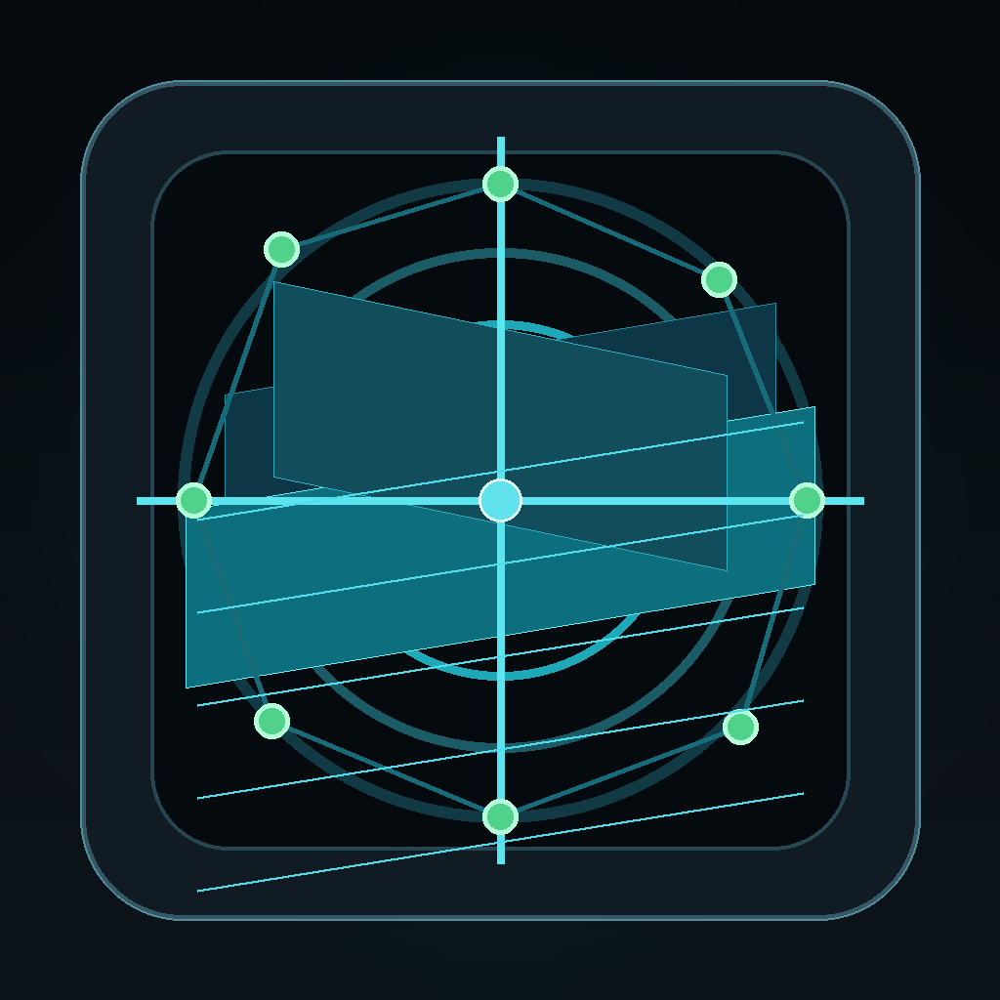

# MOPR

<p align="left">
  
</p>

**Medical Observation & Projection Renderer**

MOPR is an experimental Windows workbench for importing, organizing, validating, viewing, and preparing DICOM CT and MRI data. Its purpose is to provide a modular, locally operated foundation for medical-image workflows while keeping machine configuration, user identity, repository integrity, persistence, and imaging responsibilities clearly separated.

The current solution combines a Prism-based WPF desktop shell with dedicated feature modules, reusable application and domain services, protected machine-wide configuration, local user provisioning and sign-in, persistent DICOM metadata, managed repository operations, and integrity assurance through MIRAS.

> **Important**
>
> MOPR is intended for visualization, research, prototyping, and educational use. It is not intended for diagnostic use, treatment planning, clinical reporting, or medical decision-making.

## Purpose and Context

MOPR is designed as a local-first medical-imaging workbench for environments in which DICOM data, configuration, identities, and derived information must remain under the control of the local deployment.

The architecture follows these principles:

- local processing instead of cloud-dependent medical-image workflows
- explicit separation between UI modules, application orchestration, persistence, repository storage, DICOM processing, and integrity assurance
- guided setup and identity flows for users without specialist IT knowledge
- protected machine-wide configuration and explicit administrative authorization
- auditable operations with a resolved current user or setup identity
- explicit verification and repair instead of silent data modification
- reusable contracts across projects targeting different .NET platforms
- English default resources and German localization owned by the responsible project
- extensibility for later measurements, reconstruction, segmentation, and Unreal-based workflows without coupling them to current integrity or import operations

## Current Capabilities

The current implementation includes:

- DICOM grayscale image display and frame access
- grouping of image instances by `SeriesInstanceUID`
- assignment of image series to multiple viewports
- single, 2 x 2, MPR, and axial/sagittal/coronal viewport layouts
- selection and clearing of individual viewports
- window and level handling, including presets and interactive dragging
- pixel inspection and measurement overlays
- DICOM metadata extraction, image decoding, folder scanning, and series loading
- a dedicated import module with source selection and result presentation
- import-source resolution for local folders, removable media, optical media, virtual drives, ISO images, and network locations
- application-level DICOM import coordination with current-user audit identity resolution
- repository-level DICOM import with persistence integration and compensation
- Entity Framework Core persistence with SQL Server and in-memory test support
- persistence and repository integrity verification
- controlled repository repair operations
- MIRAS issue mapping, result classification, localized messages, and flow-state management
- machine, database, repository, and security configuration contracts
- guided repository, database, verification, and completion setup workflow
- protected machine-configuration storage and setup audit identity handling
- repository-location validation and setup-completion coordination
- Windows administrative authorization
- operating-system identity discovery
- initial local user provisioning and validation
- local user sign-in and current-user context management
- startup routing for machine setup, user provisioning, blocked users, unavailable identity, and the regular workbench
- application-wide single-instance protection and foreground activation
- English and German localization
- isolated test projects for desktop, identity, imaging, setup, application services, Core, MIRAS, persistence, and repository functionality

Extended configuration interfaces, additional user-management workflows, advanced measurements, volumetric reconstruction, segmentation, and Unreal-related workflows remain separate work packages or areas for future development.

## Architecture

MOPR separates shared contracts, WPF infrastructure, desktop composition, feature modules, reusable services, persistence, repository operations, integrity assurance, and tests.

### Shared Contracts

`MarcusRunge.Mopr.Workbench.Contracts` targets `.NET Standard 2.1`. It contains technology-independent contracts and data models shared by projects targeting different .NET versions.

The contract project includes:

- application administration, configuration, identity, lifetime, and security abstractions
- current-user, operating-system identity, provisioning, and sign-in models
- imaging layouts, tools, viewport state, and study-loading models
- geometry and measurement models
- machine-configuration validation and setup-completion models
- Unreal object and mesh transfer models
- localized English and German resources

A small `IsExternalInit` compatibility type allows records and init-only properties to remain available while targeting `.NET Standard 2.1`.

### Core WPF and MVVM Infrastructure

`MarcusRunge.Mopr.Workbench.Core` targets `.NET 10 for Windows` and contains shared Prism and WPF infrastructure, including:

- navigation-aware view-model base classes
- region-aware view-model base classes
- navigation confirmation support
- shared navigation names
- shared region names
- application-wide Prism events for completed machine setup and initial user provisioning

### Desktop Application

The desktop project is the WPF and Prism composition root. It owns:

- application startup and shutdown
- dependency registration and module composition
- the main window and its view model
- machine-wide application, database, repository, and security configuration
- configuration loading, validation, path handling, DPAPI protection, and access control
- Windows administrator-role evaluation and administrative authorization
- Windows identity access and operating-system identity mapping
- setup audit identity resolution
- startup diagnostics and machine-level startup-route selection
- user-level startup-route selection
- application lifetime coordination
- single-instance coordination, request forwarding, and foreground activation
- application assets and localized resources

The desktop shell remains the composition root. Feature-specific UI and workflow behavior belongs to Prism modules rather than the desktop project.

### Identity Module

`MarcusRunge.Mopr.Workbench.Modules.Identity` provides the user-facing identity and initial provisioning flow. It includes:

- initial user provisioning
- presentation of blocked-user state
- presentation of unavailable operating-system identity
- Prism registration and navigation
- shared identity control styles
- localized English and German resources

The module consumes identity services from `Services.Application`. It does not directly access Windows identity APIs or persistence repositories.

### Imaging Module

`MarcusRunge.Mopr.Workbench.Modules.Imaging` owns the image-viewing workspace and its WPF-specific behavior. It includes:

- the imaging workbench
- image viewer and command bar
- series and properties panels
- viewport layout host and viewport tiles
- measurement overlays and interaction state
- focus, mouse-selection, pixel-hover, measurement, and viewport-interaction behaviors
- viewport image-geometry calculation
- module-specific services and localized resources

### Import Module

`MarcusRunge.Mopr.Workbench.Modules.Import` provides the guided DICOM import user interface. It includes:

- source selection and source discovery
- import execution and cancellation
- structured import-result presentation
- Prism module registration and navigation
- localized English and German resources

The module delegates operating-system integration and workflow coordination to `Services.Application` and does not directly own DICOM parsing, persistence, or repository storage.

### Setup Module

`MarcusRunge.Mopr.Workbench.Modules.Setup` provides a guided, multi-step setup area with:

- repository, database, verification, and completion setup steps
- `SetupModule` and `SetupViewModel`
- dedicated views and code-behind files for each setup step
- shared setup control styles in `Themes/SetupControls.xaml`
- localized English and German resources

Machine setup and initial user provisioning are separate responsibilities. After machine setup has completed, startup routing can continue into initial user provisioning when no usable application user exists.

### Application Services

`MarcusRunge.Mopr.Workbench.Services.Application` targets `.NET 10 for Windows` and contains reusable desktop-bound application services for:

- dialogs and file dialogs
- WPF image-source and media handling
- current-user context management
- user provisioning and validation
- local user sign-in
- mapping the current user to an audit identity
- DICOM import orchestration
- import-source detection and resolution
- removable, optical, virtual, local, and network source discovery
- mapping application requests to repository import operations

The assembly exposes its service groups through `ApplicationFactory` and `IApplication`.

### Core Services

`MarcusRunge.Mopr.Workbench.Services.Core` targets `.NET Standard 2.1` and provides application-wide imaging coordination for:

- series and viewport selection
- imaging layouts and tools
- viewport state
- window and level changes
- study loading

The assembly exposes these services through `CoreFactory`, `ICore`, and `IImagingService`.

### DICOM Services

`MarcusRunge.Mopr.Workbench.Services.Dicom` targets `.NET Standard 2.1` and provides:

- DICOM file metadata extraction
- grayscale image creation
- image-frame access
- DICOM folder scanning and import results
- metadata and image service contracts
- service composition through `DicomFactory`

This assembly owns DICOM parsing and image decoding. It does not own managed repository placement or persistence transactions.

### MIRAS

MIRAS is the **Medical Image Recovery and Assurance System**.

`MarcusRunge.Mopr.Workbench.Services.Miras` targets `.NET 10` and is responsible for:

- orchestrating persistence and repository integrity checks
- mapping technical findings to MIRAS issues
- classifying operation results
- producing localized, user-oriented messages
- preserving technical diagnostics separately from user-facing text
- coordinating one application-level integrity flow at a time
- exposing the current flow state and most recent regular result

MIRAS uses `IFlow` for execution-state coordination and `IOperations` for integrity operations. Flow states and result models are owned by the MIRAS service assembly.

MIRAS does not silently repair repository data and does not automatically create Unreal objects. Repair operations remain explicit, and Unreal artifacts may only be created by later workflows from validated DICOM and persistence data.

### Persistence

`MarcusRunge.Mopr.Workbench.Services.Persistence` targets `.NET 10` and contains:

- Entity Framework Core database contexts and context factories
- SQL Server and in-memory provider configuration
- reactive persistence configuration and asynchronous initialization
- Entity Framework Core migrations and model snapshots
- DICOM import persistence
- entity repositories
- user persistence and activation state
- persistence-integrity verification
- database connection testing
- serialization of measurement data
- repository-location records
- studies, series, instances, measurements, users, and Unreal-object persistence

The persistence layer includes auditable entities and dedicated Entity Framework configurations for the stored domain types.

### Repository

`MarcusRunge.Mopr.Workbench.Services.Repository` targets `.NET 10` and contains:

- managed DICOM import and file placement
- repository scanning across configured locations
- file identity and path verification
- repository issue detection
- controlled repair operations
- compensation and rollback for incomplete imports
- serialization of repository operations through a coordinator

Repository verification and repair remain separate operations. A MIRAS check reports findings and recommended actions but does not silently alter data.

## Project Structure

The following tree shows the source-controlled solution areas. Build output, IDE state, generated compiler files, temporary files, local exports, and user-specific project settings are intentionally omitted.

```text
Wpf/
├── Clean-BuildArtifacts.ps1
├── Export-MoprSourceCode.ps1
├── MarcusRunge.Mopr.Workbench.slnx
└── MarcusRunge.Mopr.Workbench/
    ├── Contracts/
    │   ├── Application/
    │   │   ├── Administration/Services/
    │   │   ├── Configuration/
    │   │   │   ├── Models/
    │   │   │   └── Services/
    │   │   ├── Identity/
    │   │   │   ├── Models/
    │   │   │   └── Services/
    │   │   ├── Lifetime/Services/
    │   │   └── Security/Services/
    │   ├── Compatibility/
    │   ├── Enums/
    │   ├── Imaging/
    │   ├── Models/
    │   │   ├── Configuration/
    │   │   ├── Geometry/
    │   │   ├── Measurements/
    │   │   └── Unreal/
    │   └── Properties/
    ├── Core/
    │   ├── Events/
    │   └── Mvvm/
    ├── Desktop/
    │   ├── Application/
    │   │   ├── Administration/
    │   │   ├── Configuration/
    │   │   ├── Diagnostics/
    │   │   ├── Identity/
    │   │   ├── Lifetime/
    │   │   ├── SingleInstance/
    │   │   └── Startup/
    │   ├── Assets/
    │   ├── Properties/
    │   ├── ViewModels/
    │   └── Views/
    ├── Modules/
    │   ├── Identity/
    │   │   ├── Properties/
    │   │   ├── Themes/
    │   │   ├── ViewModels/
    │   │   └── Views/
    │   ├── Imaging/
    │   │   ├── Behaviors/
    │   │   ├── Infrastructure/Viewports/
    │   │   ├── Properties/
    │   │   ├── Services/
    │   │   ├── ViewModels/
    │   │   └── Views/Viewports/
    │   ├── Import/
    │   │   ├── Properties/
    │   │   ├── ViewModels/
    │   │   └── Views/
    │   └── Setup/
    │       ├── Properties/
    │       ├── Themes/
    │       ├── ViewModels/
    │       └── Views/
    ├── Services/
    │   ├── Application/
    │   │   ├── Bases/
    │   │   ├── Contracts/
    │   │   │   ├── Dialog/
    │   │   │   ├── Identity/
    │   │   │   ├── Import/
    │   │   │   └── Media/
    │   │   ├── Enums/
    │   │   ├── Implementations/
    │   │   │   ├── Dialog/
    │   │   │   ├── Identity/
    │   │   │   ├── Import/
    │   │   │   └── Media/
    │   │   ├── Models/
    │   │   └── Properties/
    │   ├── Core/
    │   │   ├── Bases/
    │   │   ├── Contracts/Imaging/
    │   │   ├── Implementations/Imaging/
    │   │   └── Properties/
    │   ├── Dicom/
    │   │   ├── Bases/
    │   │   ├── Contracts/
    │   │   ├── Implementations/
    │   │   └── Properties/
    │   ├── Miras/
    │   │   ├── Bases/
    │   │   ├── Contracts/
    │   │   ├── Enums/
    │   │   ├── Implementations/
    │   │   ├── Models/
    │   │   └── Properties/
    │   ├── Persistence/
    │   │   ├── Bases/
    │   │   ├── Configurations/
    │   │   ├── Contexts/
    │   │   ├── Contracts/
    │   │   ├── Entities/
    │   │   ├── Enums/
    │   │   ├── Implementations/
    │   │   ├── Migrations/
    │   │   ├── Models/
    │   │   ├── Properties/
    │   │   └── Serialization/
    │   └── Repository/
    │       ├── Bases/
    │       ├── Contracts/
    │       ├── Enums/
    │       ├── Implementations/
    │       ├── Models/
    │       └── Properties/
    └── Tests/
        ├── Desktop.Test/Application/
        │   ├── Administration/
        │   ├── Configuration/
        │   ├── Identity/
        │   └── Startup/
        ├── Modules.Identity.Test/ViewModels/
        ├── Modules.Imaging.Test/ViewModels/
        ├── Modules.Setup.Test/ViewModels/
        ├── Services.Application.Test/
        │   ├── Identity/
        │   └── Import/
        ├── Services.Core.Test/
        ├── Services.Miras.Test/
        ├── Services.Persistence.Test/
        ├── Services.Repository.Test/
        └── Test.Shared/Application/
```

Excluded content includes `bin`, `obj`, `.vs`, `TestResults`, `artifacts`, `ref`, `refint`, generated `*.g.cs` and `*.g.i.cs` files, caches, temporary files, `*.csproj.user`, and `MOPR-Backend-Source.txt`.

## Dependency Direction

The principal dependency direction is:

```text
Desktop (.NET 10 for Windows)
├── Contracts (.NET Standard 2.1)
├── Core (.NET 10 for Windows)
├── Modules.Identity (.NET 10 for Windows)
├── Modules.Imaging (.NET 10 for Windows)
├── Modules.Import (.NET 10 for Windows)
├── Modules.Setup (.NET 10 for Windows)
├── Services.Application (.NET 10 for Windows)
├── Services.Core (.NET Standard 2.1)
├── Services.Dicom (.NET Standard 2.1)
├── Services.Miras (.NET 10)
├── Services.Persistence (.NET 10)
└── Services.Repository (.NET 10)

Modules.Identity
├── Contracts
├── Core
└── Services.Application

Modules.Imaging
├── Core
├── Services.Application
└── Services.Core

Modules.Import
├── Core
└── Services.Application

Modules.Setup
├── Contracts
└── Core

Services.Application
├── Contracts
├── Services.Persistence
└── Services.Repository

Services.Core
├── Contracts
└── Services.Dicom

Services.Miras
├── Contracts
├── Services.Persistence
└── Services.Repository

Services.Repository
├── Contracts
└── Services.Persistence

Services.Persistence
└── Contracts
```

The `.NET Standard 2.1` boundary keeps shared contracts, DICOM processing, and Core imaging coordination reusable without introducing WPF, SQL Server, or other Windows-specific dependencies.

## Module and Factory Pattern

Service assemblies expose a module instance through a factory:

```text
ApplicationFactory → IApplication
CoreFactory        → ICore
DicomFactory       → IDicom
MirasFactory       → IMiras
PersistenceFactory → IPersistence
RepositoryFactory  → IRepository
```

Each factory retains one module instance per factory. The desktop application controls the overall lifetime through dependency injection.

Application services compose desktop-bound workflows:

```text
IApplication
├── IDialogService
├── IIdentityService
│   ├── ICurrentUserContextManager
│   ├── IUserProvisioningService
│   └── IUserSignInService
├── IImportService
└── IMediaService
```

Core composes the imaging service group:

```text
ICore
└── IImagingService
    ├── IImagingLayoutService
    ├── IImagingSelectionService
    ├── IImagingStudyService
    ├── IImagingToolService
    ├── IImagingViewportSelectionService
    ├── IImagingViewportService
    └── IImagingWindowLevelService
```

MIRAS composes integrity execution and flow coordination:

```text
IMiras
├── IFlow
└── IOperations
    └── CheckRepositoryAsync(...)
```

## Startup, Setup, and Identity Flow

Startup routing separates machine readiness from user readiness:

```text
Application start
    ↓ machine configuration and startup diagnostics
Machine setup required?
    ├── yes → Modules.Setup
    └── no  → resolve operating-system identity and application user
                 ├── identity unavailable → IdentityUnavailableView
                 ├── no application user  → UserProvisioningView
                 ├── user blocked         → UserBlockedView
                 └── active user          → regular workbench
```

The machine-setup flow configures and verifies the repository, database, security settings, and completion state. The identity flow then provisions the first application user when required, signs in a valid local user, and establishes the current-user context used by application services and audit identity resolution.

`MachineSetupCompletedEvent` and `InitialUserProvisioningCompletedEvent` allow the relevant modules and the desktop shell to continue routing without coupling feature view models directly to one another.

## Identity and Audit Semantics

MOPR distinguishes between four related concepts:

- the Windows identity reported by the operating system
- the persisted MOPR user record
- the current signed-in MOPR user context
- the audit identity attached to application and repository operations

`IOperatingSystemIdentityProvider` supplies normalized operating-system identity information. `IUserProvisioningService` validates and creates the corresponding MOPR user when permitted. `IUserSignInService` resolves sign-in state, while `ICurrentUserContextManager` owns the active application-user context. `CurrentUserAuditIdentityProvider` maps that context to `IAuditIdentityProvider` for auditable operations.

Setup remains usable before a regular application user exists by using the separate setup audit identity provider.

## MIRAS Result and Flow Semantics

`MirasFlowState` describes execution of the application-level flow:

```text
Idle
Running
Completed
Canceled
Failed
```

`MirasOperationStatus` describes the regular result returned by a MIRAS check:

```text
Completed
CompletedWithIssues
Blocked
Incomplete
Failed
```

These values intentionally describe different concerns. For example:

```text
MirasFlowState.Completed
MirasOperationStatus.Blocked
```

This means the application flow completed normally and MIRAS returned a blocking integrity result.

The flow guarantees:

- one active MIRAS check per MIRAS module
- shared observation of an already running check
- cancellation by caller, user action, or application shutdown
- no synthetic result for cancellation or unexpected exceptions
- clearing the previous result when a new run starts
- restart after completion, cancellation, or an unexpected failure
- no restart after final application shutdown
- property-change notifications for UI binding

## DICOM Import Flow

The import path is deliberately separated into distinct responsibilities:

```text
Modules.Import
    ↓ user interaction
Services.Application
    ↓ source resolution, current-user audit identity, workflow mapping
Services.Repository
    ↓ managed file placement, coordination, compensation
Services.Persistence
    ↓ studies, series, instances, users, and repository metadata
Services.Dicom
    ↓ parsing, validation, metadata, and image decoding
```

Supported source classifications include local directories, USB and removable drives, SD cards, CD-ROM and DVD media, network shares, mapped network drives, virtual drives, and ISO images. Source detection can be automatic or explicitly selected.

## Configuration and Administration

The application separates shared configuration contracts from Windows-specific implementations.

Configuration areas include:

- application configuration
- database configuration
- repository configuration
- security configuration
- machine-configuration storage
- machine-configuration path resolution
- machine-bound DPAPI protection
- directory and file access-control protection
- machine-configuration validation
- repository-location validation before configuration is accepted

Administrative operations are protected through `IAdministrativeAuthorizationService`. The desktop implementation evaluates the current Windows administrator role through `IWindowsAdministratorRoleEvaluator`.

Machine setup, initial user provisioning, regular sign-in, and later user administration are distinct concerns. The current identity module covers startup-related provisioning and user-state presentation; broader user management remains a separate application area.

## Localization

MOPR uses English default resources and German satellite resources. Each project owns the resources for its user-facing responsibilities.

Examples include:

```text
Contracts/Properties/Resources.resx
Contracts/Properties/Resources.de.resx

Desktop/Properties/Resources.resx
Desktop/Properties/Resources.de.resx

Modules/Identity/Properties/Resources.resx
Modules/Identity/Properties/Resources.de.resx

Modules/Imaging/Properties/Resources.resx
Modules/Imaging/Properties/Resources.de.resx

Modules/Import/Properties/Resources.resx
Modules/Import/Properties/Resources.de.resx

Modules/Setup/Properties/Resources.resx
Modules/Setup/Properties/Resources.de.resx

Services/Application/Properties/Resources.resx
Services/Application/Properties/Resources.de.resx

Services/Miras/Properties/Resources.resx
Services/Miras/Properties/Resources.de.resx
```

Localized enum values use the established `EnumDescriptionTypeConverter` and `LocalizedDescription` infrastructure.

Technical identifiers, filesystem paths, stack traces, and raw exception details must not be copied into ordinary user-facing messages.

## Build

### Requirements

- Windows 10 or Windows 11
- .NET 10 SDK
- Visual Studio with the **.NET desktop development** workload
- SQL Server LocalDB for the default desktop persistence configuration

### Build the Solution

Run from the `Wpf` directory containing `MarcusRunge.Mopr.Workbench.slnx`:

```powershell
dotnet build .\MarcusRunge.Mopr.Workbench.slnx --configuration Debug
```

### Run the Desktop Application

```powershell
dotnet run --project .\MarcusRunge.Mopr.Workbench\Desktop\MarcusRunge.Mopr.Workbench.csproj --configuration Debug
```

## Tests

Run all tests:

```powershell
dotnet test .\MarcusRunge.Mopr.Workbench.slnx --configuration Debug
```

Run individual test projects:

```powershell
dotnet test .\MarcusRunge.Mopr.Workbench\Tests\Desktop.Test\MarcusRunge.Mopr.Workbench.Test.csproj --configuration Debug
dotnet test .\MarcusRunge.Mopr.Workbench\Tests\Modules.Identity.Test\MarcusRunge.Mopr.Workbench.Modules.Identity.Test.csproj --configuration Debug
dotnet test .\MarcusRunge.Mopr.Workbench\Tests\Modules.Imaging.Test\MarcusRunge.Mopr.Workbench.Modules.Imaging.Test.csproj --configuration Debug
dotnet test .\MarcusRunge.Mopr.Workbench\Tests\Modules.Setup.Test\MarcusRunge.Mopr.Workbench.Modules.Setup.Test.csproj --configuration Debug
dotnet test .\MarcusRunge.Mopr.Workbench\Tests\Services.Application.Test\MarcusRunge.Mopr.Workbench.Services.Application.Test.csproj --configuration Debug
dotnet test .\MarcusRunge.Mopr.Workbench\Tests\Services.Core.Test\MarcusRunge.Mopr.Workbench.Services.Core.Test.csproj --configuration Debug
dotnet test .\MarcusRunge.Mopr.Workbench\Tests\Services.Miras.Test\MarcusRunge.Mopr.Workbench.Services.Miras.Test.csproj --configuration Debug
dotnet test .\MarcusRunge.Mopr.Workbench\Tests\Services.Persistence.Test\MarcusRunge.Mopr.Workbench.Services.Persistence.Test.csproj --configuration Debug
dotnet test .\MarcusRunge.Mopr.Workbench\Tests\Services.Repository.Test\MarcusRunge.Mopr.Workbench.Services.Repository.Test.csproj --configuration Debug
```

The test suites cover:

- single-instance application behavior
- Windows administrative authorization
- application, machine, and repository-location configuration validation
- protected machine-configuration storage
- operating-system identity resolution
- machine-level and user-level startup-route selection
- initial user provisioning and validation
- local user sign-in and current-user context management
- current-user audit identity resolution
- guided setup workflow and setup view-model behavior
- identity-module provisioning view-model behavior
- imaging workbench view-model behavior
- import-source resolution and integration
- application-level DICOM import orchestration
- MIRAS flow state, concurrency, cancellation, restart, and shutdown behavior
- MIRAS result mapping, localization, and edge cases
- persistence integration and integrity verification
- repository import, repair, compensation, and operation coordination

Some integration tests may require local infrastructure or configuration that is not needed by unit tests.

## Safety and Privacy

MOPR is designed for local processing. Cloud-based AI or machine-learning services are not part of the intended architecture.

DICOM data, user identities, audit information, and derived medical-imaging information should remain under the control of the local deployment. Deployments must apply appropriate access controls, storage protection, backup policies, and applicable data-protection requirements.

Repository repair is explicit and separate from integrity inspection. MIRAS reports findings and recommended actions but does not silently alter data during a check.

User provisioning and sign-in establish application identity for authorization, routing, and auditing. They do not replace operating-system security, Windows access control, or deployment-specific administrative policies.

## License

See [LICENSE](LICENSE).
